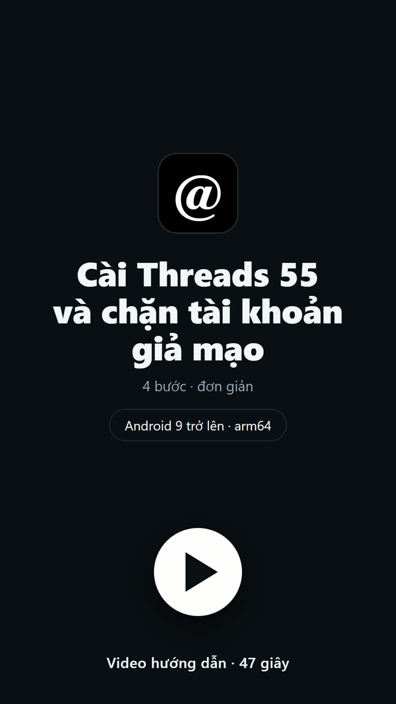

# Clone Blocker cho Threads

*Tiếng Việt · [English](README.en.md)*

Clone Blocker sửa ứng dụng Threads của Meta trên Android thành một bản ký lại —
mã ứng dụng `app.tree55.threads`, tên hiển thị **Threads 55** — có thể tự chặn
các tài khoản giả mạo dựa trên một danh sách chung của cộng đồng.

Bản này cài **song song** với Threads chính thức chứ không thay thế. Dự án không
liên kết với Meta và không có trên kho ứng dụng nào.

## Cài đặt

<a href="docs/media/threads55-install-guide.mp4"></a>

**[Video hướng dẫn — 47 giây](docs/media/threads55-install-guide.mp4)**: bấm vào ảnh để xem ngay trên GitHub,
hoặc [tải tệp MP4](https://raw.githubusercontent.com/Tree55-org/ThreadsMod/main/docs/media/threads55-install-guide.mp4) về máy.
Video là mô phỏng giao diện, không phải quay từ máy thật.

Tải ở **[trang phát hành](https://github.com/Tree55-org/ThreadsMod/releases/tag/release)**:

| Tệp | Dung lượng | Dùng khi nào |
|---|---:|---|
| `tree55-threads-mod.apk` | 129 MB | Chính là ứng dụng. Tải tệp này. |
| `tree55-threads-mod.zip` | 83 MB | Cũng chính tệp APK đó nhưng đã nén — dùng khi mạng hoặc trình duyệt chặn tải `.apk`. Giải nén rồi cài. |

Cần **Android 9 trở lên**, chip **arm64-v8a**. Bạn sẽ phải cho phép cài ứng dụng
từ nguồn không xác định.

Hãy kiểm tra tệp trước khi cài — mã băm phải đúng chính xác:

```
SHA-256  e6ec4d70dacfa094659e31e09f2a890c537ba72b574767d62337a6a929c672a4
```

```powershell
Get-FileHash -Algorithm SHA256 tree55-threads-mod.apk    # Windows
sha256sum tree55-threads-mod.apk                         # Linux / macOS
```

Nếu mã băm không khớp thì đừng cài.

Cài đè lên bản **Threads 55** cũ thì dữ liệu vẫn còn. Bản này không bao giờ cập
nhật hay thay thế được Threads chính thức, và bản `com.threadsmod.barcelona` cũ
là một ứng dụng riêng mà trình cập nhật không nối sang được.

Hãy đọc [ứng dụng làm gì](#ứng-dụng-làm-gì) và [rủi ro](#rủi-ro) trước, rồi thử
bằng một tài khoản mà bạn chấp nhận mất.

## Ứng dụng làm gì

- **Tự chặn tài khoản giả mạo khi bạn lướt.** Cứ mười phút một lần trong lúc mở
  ứng dụng, nó tải danh sách chung đã ký, rồi chặn một tài khoản trong danh sách
  ngay khi bài viết hoặc trả lời của chính tài khoản đó hiện lên màn hình — mỗi
  lần một tài khoản, có giãn cách ngẫu nhiên.
- **Việc này luôn bật.** Không có nút tắt. Cách duy nhất để dừng là gỡ ứng dụng.
- **Mỗi bài viết và trả lời có một nút Chặn**, mở đúng một hộp thoại *Chặn và báo
  cáo*: trích đoạn bài viết, lý do, tuỳ chọn *Chặn luôn hồ sơ này*, và Huỷ.
- **Không bao giờ tự gửi báo cáo** — chỉ gửi khi bạn bấm.
- **Trang Cài đặt và Hoạt động** ở cuối ngăn kéo bên trái: tình trạng danh sách,
  số bản ghi, hàng đợi báo cáo và lịch sử.
- **Proxy SOCKS5 tuỳ chọn**, chỉ áp dụng cho riêng ứng dụng này. Mặc định tắt.
- **Cập nhật trong ứng dụng có chữ ký**, giao cho trình cài đặt thường của
  Android — không bao giờ cài ngầm hay cần root.

**Các lượt chặn là thật.** Chúng chạy qua chính chức năng chặn của Threads bằng
phiên đăng nhập của bạn, nên sẽ hiện trong Threads chính thức, áp dụng trên mọi
thiết bị dùng tài khoản đó, và **không** được hoàn tác khi bạn gỡ ứng dụng.

## Tình trạng

Bản hiện tại `tree55-threads-mod.apk`, phát hành 2026-09-06, từ loạt patchlet
005 r1, 010 r5, 020 r24, 030 r7, 040 r2, 050 r17, 060 r14, 070 r10, 080 r3,
085 r2, 090 r62.

**Chưa có bản phát hành nào từng được cài hay chạy thử trên máy thật.** Mọi bản
đều ghi `runtimeValidation: not-run`. Các cổng kiểm tra khi phát hành đều là kiểm
tra tĩnh — chúng chứng minh tính chất của tệp đã ký, chứ không chứng minh ứng
dụng chạy được. Đăng nhập, lướt bảng tin, một lượt chặn thật, việc gửi báo cáo và
trình cập nhật đều chưa được thử trên thiết bị. Hãy xem đây là phần mềm chưa được
kiểm chứng.

Lịch sử: [docs/CHANGELOG.md](docs/CHANGELOG.md).

## Quyền riêng tư

Việc chặn dùng chính chức năng đã xác thực của Threads. **Không có phiên đăng
nhập, cookie, token hay mã tài khoản Threads nào được gửi về máy chủ của dự án.**

Danh sách được đọc từ ba nguồn cố định, và mã SHA-256 của từng phần đều được đối
chiếu với một bản kê đã ký trước khi đọc. Chỉ có đúng hai thứ được gửi đi: một
báo cáo, và chỉ khi bạn bấm gửi; cùng một tín hiệu kích hoạt ẩn danh cho mỗi lần
cài. Không có SDK thống kê, quảng cáo hay báo lỗi nào — điều này được kiểm tra
bắt buộc khi phát hành.

Khi bạn gửi báo cáo, máy chủ trung chuyển lưu địa chỉ IP, User-Agent và thành
phố/quốc gia suy ra từ đó, không tự động xoá sau thời hạn nào. Chi tiết:
[docs/10](docs/10-REPORTING-AND-LIMITS.md).

## Rủi ro

- Sửa APK làm mất chữ ký của Meta, nên bản này không bao giờ dùng chung tên gói
  với Threads chính thức được.
- Các điểm cuối riêng tư và tên lớp đã làm rối không phải API ổn định. Mỗi lần
  Threads cập nhật là phải làm lại từ đầu.
- Play Integrity, đăng nhập bằng Facebook/Instagram, App Links và cập nhật qua
  Play nhiều khả năng sẽ hỏng hoặc chạy không đầy đủ với chữ ký cá nhân.
- Tự động dùng API riêng tư có thể vi phạm điều khoản của Meta và khiến tài khoản
  gặp rủi ro. Hãy dùng tài khoản dùng một lần.
- Đừng phát tán lại APK đã sửa của Meta khi chưa xem xét pháp lý.

## Tự build

Cần Windows với PowerShell 7, một JDK, Android SDK build-tools 36.0.0 và bộ công
cụ đã ghim (Apktool 3.0.3, APKEditor 1.4.9, JADX 1.5.6). Các tệp APK gốc của
Threads và bộ công cụ **không** nằm trong kho này; mã băm chính xác của chúng
được ghim trong tệp resolution.

Việc phát hành gồm hai bước: một lượt `SignedReview` không xuất bản, một lượt
duyệt thủ công để nâng resolution lên `verified-current`, rồi một lượt `Release`
mới xuất bản. Câu lệnh nằm ở [docs/03](docs/03-BUILD-SIGN-TEST-PLAN.md); các
script từng bước nằm ở [patchlets/README.md](patchlets/README.md).

Không có gì được sửa tay. Bản mod là mười một patchlet có thứ tự, đếm chính xác,
chạy lại trên một bộ nguồn đã khoá mã băm, với mọi ký hiệu đã làm rối được tách
riêng vào resolution của từng phiên bản. Sai lệch bất kỳ đều dừng lại và không
tạo ra tệp nào.

## Cấu trúc kho

| Đường dẫn | |
|---|---|
| `patchlets/` | Nguồn chính thức — mọi thay đổi bắt đầu từ đây |
| `patchlets/features/` | Mười một patchlet |
| `patchlets/resolutions/` | Ràng buộc ký hiệu và bằng chứng theo từng phiên bản |
| `patchlets/tools/` | Pipeline build và các trình kiểm tra DEX |
| `docs/` | Tài liệu thiết kế và vận hành |
| `AGENTS.md` | Quy tắc bắt buộc của dự án |

Các tệp APK gốc, `dist/`, `work/`, `decompiled/` và `.tools/` chỉ nằm ở máy —
đó là tệp nhị phân của Meta, tệp vượt giới hạn dung lượng của GitHub, hoặc bằng
chứng của từng lượt chạy. Mã băm của chúng đã được ghim nên vẫn build lại được.

## Tài liệu

Tài liệu kỹ thuật viết bằng tiếng Anh.

[Changelog](docs/CHANGELOG.md) ·
[01 Kiểm kê APK](docs/01-APK-INVENTORY-AND-DECOMPILATION.md) ·
[02 Tính khả thi và thiết kế](docs/02-AUTO-BLOCK-FEASIBILITY-AND-DESIGN.md) ·
[03 Build, ký, kiểm thử](docs/03-BUILD-SIGN-TEST-PLAN.md) ·
[04 Kiểm toán toàn vẹn](docs/04-INTEGRITY-AND-DELIVERY-AUDIT.md) ·
[05 Bản demo cũ](docs/05-HISTORICAL-DEMO-BUILDS.md) ·
[07 Hướng dẫn Clone Blocker](docs/07-CLONE-BLOCKER-AUTO-BLOCK.md) ·
[08 Hệ thống patchlet](docs/08-AI-DRIVEN-PATCHLETS.md) ·
[09 Giao diện](docs/09-ACTIVITY-SETTINGS-AND-INLINE-BLOCK.md) ·
[10 Báo cáo và giới hạn](docs/10-REPORTING-AND-LIMITS.md) ·
[11 Proxy SOCKS5](docs/11-SOCKS5-PROXY.md) ·
[12 Chặn tự động](docs/12-PASSIVE-BLOCKING.md) ·
[13 Cập nhật trong ứng dụng](docs/13-IN-APP-UPDATES.md)

## Giấy phép

[MIT](LICENSE) cho phần mã nguồn và tài liệu của riêng dự án này. Giấy phép đó
không áp dụng cho ứng dụng Threads của Meta, cho bất kỳ APK nào tạo ra từ nó, hay
cho nhãn hiệu nào của Meta. Các thành phần bên thứ ba được ghi nhận trong
[NOTICE](NOTICE).
